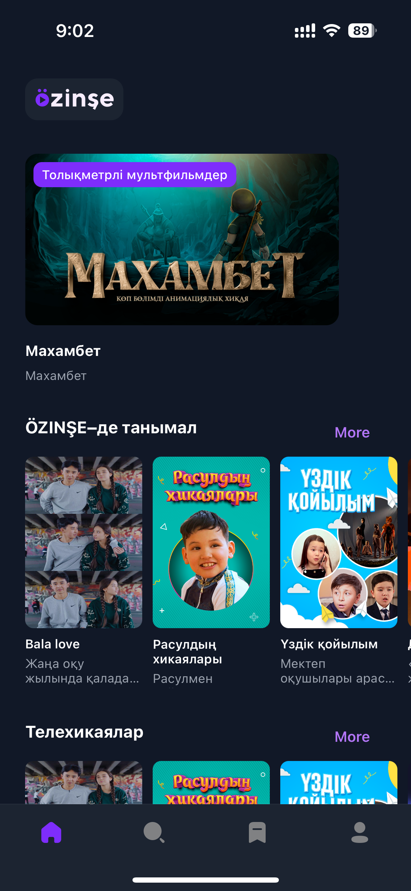
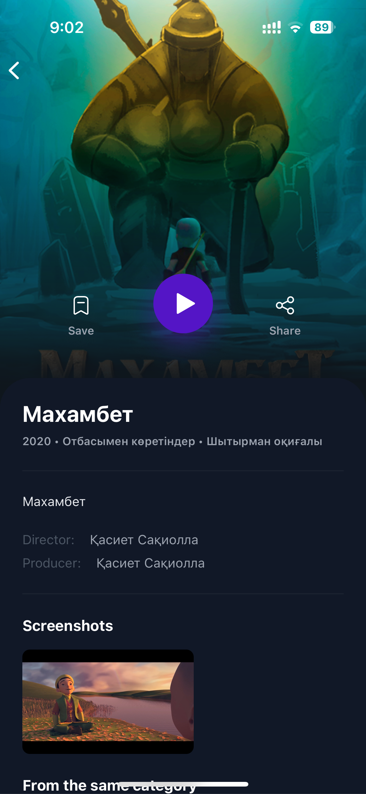
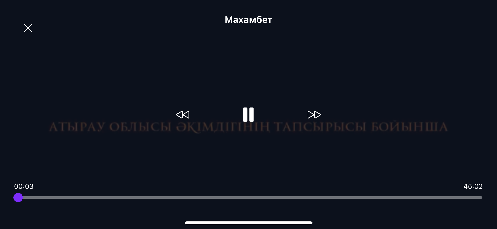
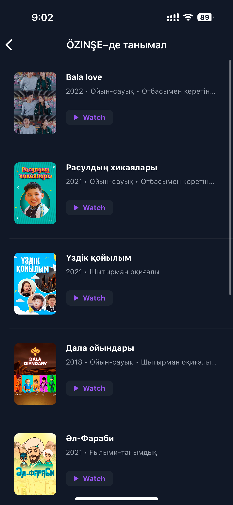
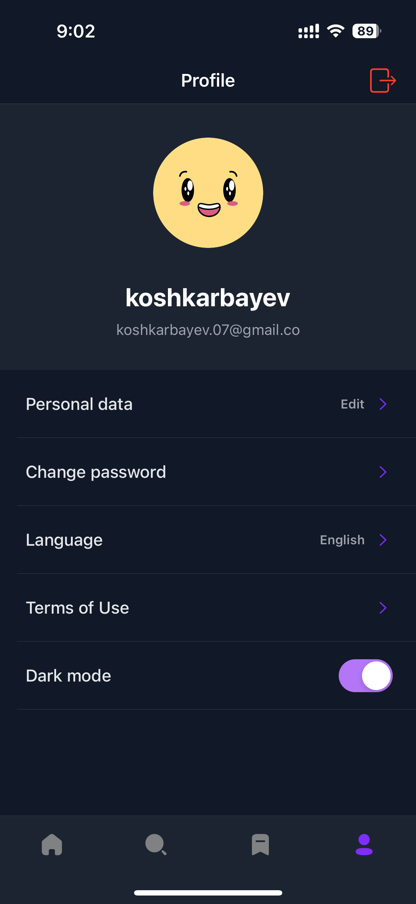
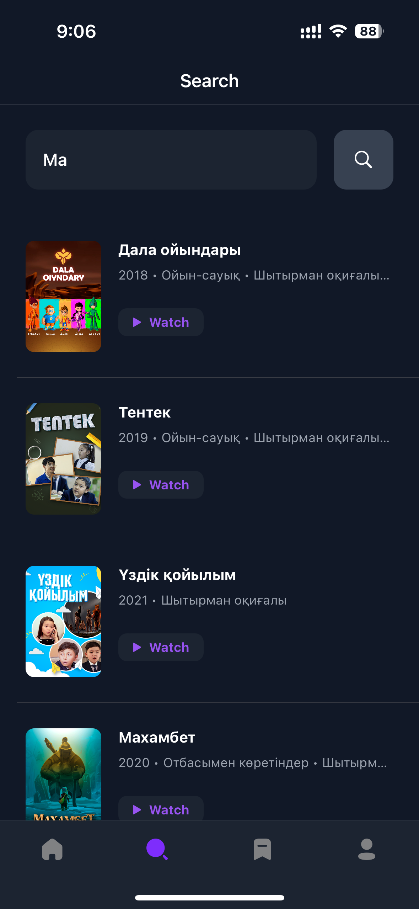
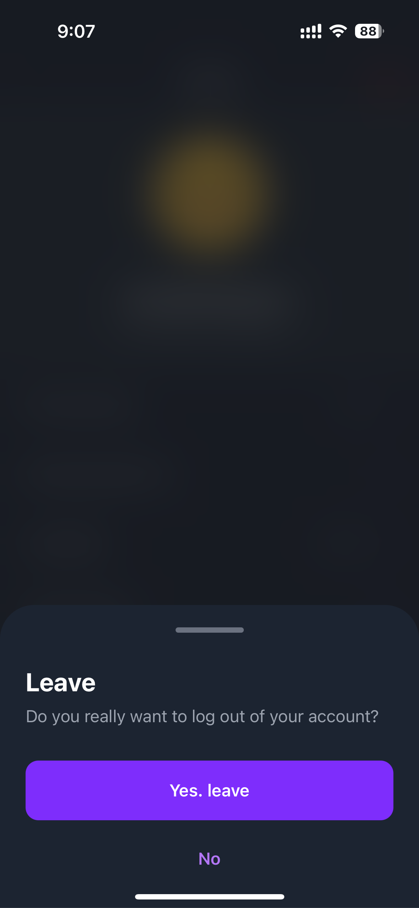
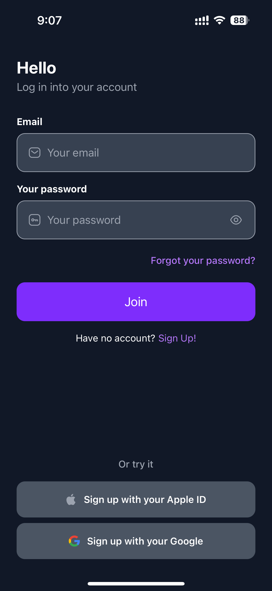

# ÖZINŞE Mobile Application

<div align="center">
  
  <h1>ÖZINŞE iOS Application by Sanzhar Koshakarbayev</h1>
</div>
  
  
  
# 📔 Table of Contents
- [Feautures](#-Feautures)
- [About the Project](#-About-the-Project)
  * [Screenshots](#-Screenshots)
  * [Used Pods](#-Pods)
- [Getting Started](#-Getting-Started)
  * [Run Locally](#-Run-Locally)
- [Contributors](#-Author)
- [License](#-License)

<br/> 

>>📣 **IMPORTANT!** 
>>
>>Read the [Run Locally](#-Run-Locally) section to correct run the project


  
## 🌟 Features

* Easy to use
* Simple Swift syntax
* Lightweight readable codebase


<br/> 
 
## 📲 About the Project

"ÖZINŞE iOS" presents a delightful iOS mobile experience crafted for indulging in captivating Kazakh series and movies. Within this app, discover an array of enchanting features: an inviting main page brimming with tailored recommendations, a seamless movie player for immersive viewing, a comprehensive movie info scene offering intricate details, a personalized profile page, a convenient movie search feature, and elegantly designed login pages. Embark on a journey through the rich tapestry of Kazakh entertainment with ÖZINŞE iOS.

<br/> 

### 📷 Screenshots

<div> 
  
  
  
  
  
  
  
  
</div>

<br/> 

### 📦 Pods

<ul>
    <li><a href="https://cocoapods.org/pods/SnapKit">SnapKit</a></li>
    <li><a href="https://github.com/Juanpe/SkeletonView">SkeletonView</a></li>
    <li><a href="https://github.com/Alamofire/Alamofire">Alamofire</a></li>
    <li><a href="https://github.com/SwiftyJSON/SwiftyJSON">SwiftyJSON</a></li>
    <li><a href="https://github.com/SVProgressHUD/SVProgressHUD">SVProgressHUD</a></li>
    <li><a href="https://github.com/onevcat/Kingfisher/releases/tag/6.3.1">Kingfisher (6.3.1)</a></li>
    <li><a href="https://github.com/mukeshydv/YoutubePlayerView">YoutubePlayerView</a></li>
</ul>


<br/> 

## 	🚀 Getting Started

Welcome to ÖZINŞE iOS, your gateway to a world of captivating Kazakh series and movies. Follow these simple steps to get started with the app:


<!-- Run Locally -->
### 🛠 Run Locally

#### 1️⃣ Download Xcode
Ensure you have Xcode installed on your Mac. Xcode is the integrated development environment (IDE) for macOS that contains everything you need to build iOS apps.

#### 2️⃣ Clone the Repository
Clone the ÖZINŞE iOS repository to your local machine using your preferred version control system (such as Git). You can obtain the repository link from the designated repository hosting platform.

#### 3️⃣ Open the Project
Launch Xcode and open the ÖZINŞE iOS project by selecting "Open" from the File menu and navigating to the directory where you cloned the repository.

#### 4️⃣ Install Pods
After openning terminal in the local directory with the project run pod install command:
```
pod install
```

#### 5️⃣ Set iOS Deployment Target to (>13.0)
Join to the Pods file (step 1) and select all targets (step 2), then, look for "iOS Deployment Target" and set it to 13.0 in all pods


#### 6️⃣ !!! Reconfigure YoutubePlayerView

Copy all code from [YoutubePlayerView.swift](./YoutubePlayerView.swift) and paste it into file with path: ```./Pods/YoutubePlayerView/Sources/YoutubePlayerView/YoutubePlayerView.swift```, XCode will ask edit permissions, accept it


#### 7️⃣ Run the project

Run the project on any device with iOS >13.0 and enjoy it!


<br/> 

## 🧑‍💻 Author

[Sanzhar Koshkarbayev](https://t.me/koshkarbayev)


## 👮‍♂️ License
```
MIT License

Copyright (c) 2017 Juanpe Catalán

Permission is hereby granted, free of charge, to any person obtaining a copy
of this software and associated documentation files (the "Software"), to deal
in the Software without restriction, including without limitation the rights
to use, copy, modify, merge, publish, distribute, sublicense, and/or sell
copies of the Software, and to permit persons to whom the Software is
furnished to do so, subject to the following conditions:

The above copyright notice and this permission notice shall be included in all
copies or substantial portions of the Software.

THE SOFTWARE IS PROVIDED "AS IS", WITHOUT WARRANTY OF ANY KIND, EXPRESS OR
IMPLIED, INCLUDING BUT NOT LIMITED TO THE WARRANTIES OF MERCHANTABILITY,
FITNESS FOR A PARTICULAR PURPOSE AND NONINFRINGEMENT. IN NO EVENT SHALL THE
AUTHORS OR COPYRIGHT HOLDERS BE LIABLE FOR ANY CLAIM, DAMAGES OR OTHER
LIABILITY, WHETHER IN AN ACTION OF CONTRACT, TORT OR OTHERWISE, ARISING FROM,
OUT OF OR IN CONNECTION WITH THE SOFTWARE OR THE USE OR OTHER DEALINGS IN THE
SOFTWARE.
```
